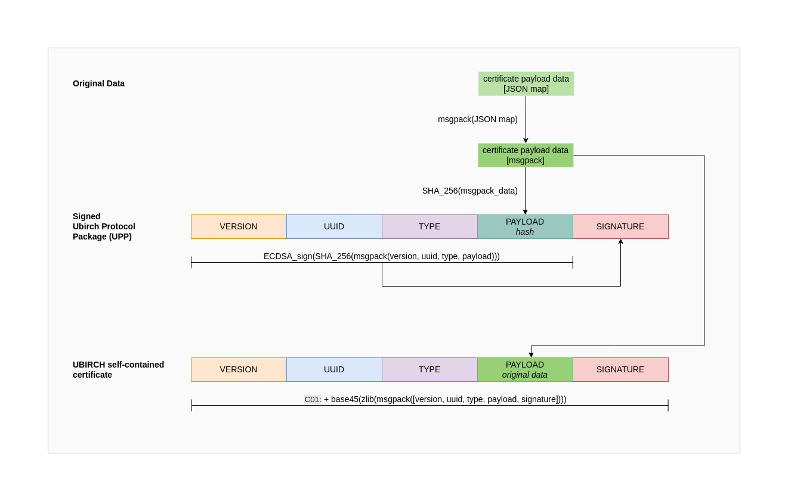
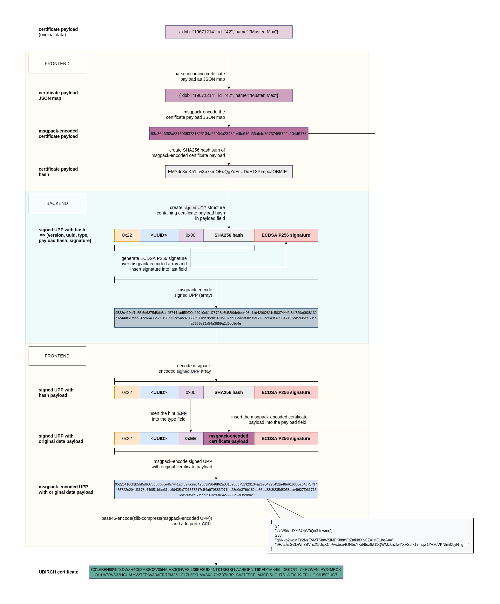
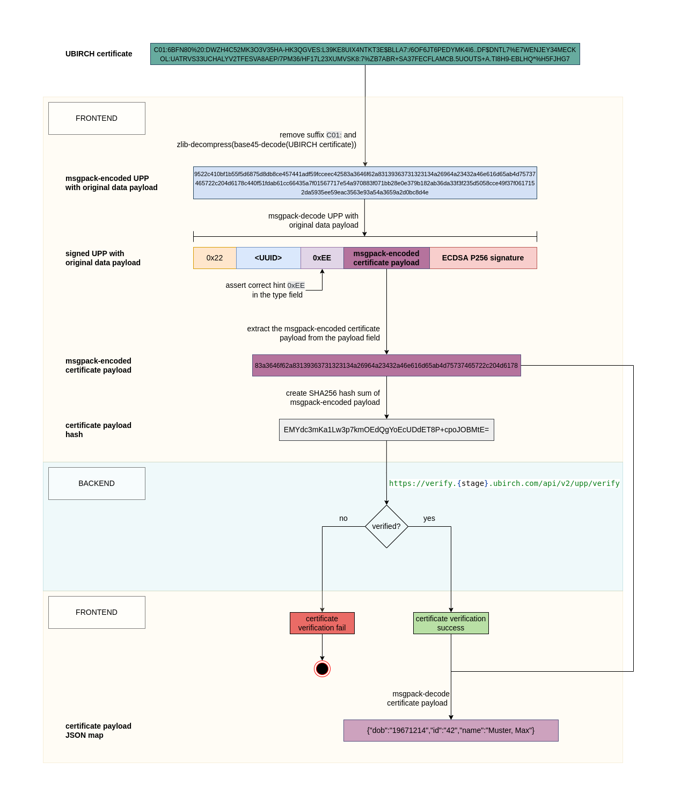

# Ubirch Certification JS Reference

A reference implementation for creating and verifying UBIRCH self-contained certificates in JavaScript/TypeScript.

Here you can find a collection of different examples of creating UBIRCH Protocol Packages (UPP) certificates and
verifying them.

Currently the following types of UPPs can be created by the
[@ubirch/ubirch-certification-js](https://www.npmjs.com/package/@ubirch/ubirch-certification-js):

* SIGNED

## Specification



## Demo

Here you can find a simple working demo:

[cert-and-verify-demo](cert-and-verify-demo.html)

**Prerequisites!!**
You need to contact the UBIRCH Support support@ubirch.com to get identity UUID, verification token and client certificate.
See Prerequisites for running this project!

## Run this project

### Prerequisites

1. You need [Node and NPM been installed](https://docs.npmjs.com/downloading-and-installing-node-js-and-npm) on your system.

2. You need to contact the UBIRCH Support support@ubirch.com to get
  1. client certificate
  2. identity UUID
  3. access token
  4. stage (normally stage for tests will be DEMO)

3. Install the client certificate on your computer.

4. Insert your identity UUID and access token in your `environment.ts`:

```
      device: '<YOUR_DEMO_DEVICE_UUID>',
      token: '<YOUR_DEMO_VERIFICATION_TOKEN>'
      stage: '<USED_STAGE_OF_UBIRCH_SYSTEM>'
```

### Run NPM project locally with Webpack Dev Server

Clone this project and call from root directory

    npm install

To start the examples call

    npm start

Open your web browser on

    http://localhost:9333/

### Build

Run

```
npm run build
```

or

```
npm run build:dev
```

Pages will be build into the `./dist` folder.
This folder can be safely moved to any other location after the build, accordingly to project needs.

## UBIRCH Certificate Creation

### Certificate Creation Process



The resulting certificate will look like this:

```text
C01:6BFN80%20:DWZH4C52MK3O3V35HA-HK3QGVES:L39KE8UIX4NTKT3E$BLLA7:/6OF6JT6PEDYMK4I6..DF$DNTL7%E7WENJEY34MECK OL:UATRVS33UCHALYV2TFESVA8AEP/7PM36/HF17L23XUMVSK8:7%ZB7ABR+SA37FECFLAMCB.5UOUTS+A.TI8H9-EBLHQ*%H5FJHG7
```

For the certification part it uses
[@ubirch/ubirch-certification-js NPM package](https://www.npmjs.com/package/@ubirch/ubirch-certification-js)
to create SIGNED UPPs. For more documentation and details about cerification look
[here](https://developer.ubirch.com/ubirch-certification-js/).

## UBIRCH UPP Certificate Verification

For the verification part it uses
[@ubirch/ubirch-verification-js NPM package](https://www.npmjs.com/package/@ubirch/ubirch-verification-js)
to verify the created unchained UPP. For more documentation and details about verification look
[here](https://developer.ubirch.com/ubirch-verification-js/).

> Due to processing time in the UBIRCH backend, it is possible for the verification of a certificate to fail shortly
> after its creation.

### Certificate Verification Process



[^1]: Contact support@ubirch.com to get a client certificate, identity UUID and access token.
